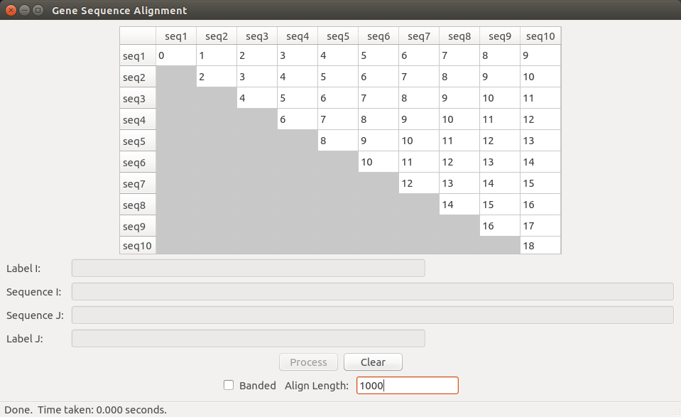
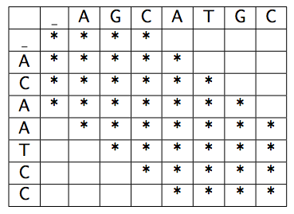
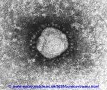
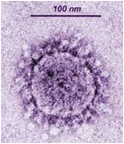

# Project 4: Gene Sequencing

### Overview

In this project, you will implement dynamic programming algorithms for computing the minimal cost of aligning gene sequences and for extracting optimal alignments.

### Objectives

1. Design and implement a Dynamic Programming algorithm that has applications to gene sequence alignment.
2. Think carefully about the use of memory in an implementation.
3. Solve a non-trivial computational genomics problem.

### Background

You are using dynamic programming to align multiple gene sequences (taxa), two at a time. In light of the SARS outbreak a few years ago, we have chosen to use the SARS virus as one of our DNA sequences. SARS is a coronavirus, and we have also provided the genomes for several other coronaviruses. It is your job in this project to align all pairsin order to assess the pair-wise similarity. To prepare to succeed on this project, make sure you understand the sequence alignment and solution extraction algorithms as presented in class and in the book.

### Provided Framework

You are provided with some scaffolding [code](../project4-gene-sequencing/project4-gene-sequencing.zip/) to help you get started on the project. We provide a PyQt GUI containing a 10x10 matrix, with a row and a column for each of 10 organisms. The organism at row *i* is the same organism for column *i*. \*\*\*Note that this matrix is *not* the dynamic programming table\*\*\*; it is simply a place to store and display the final result from the alignment of the gene sequences for each pair of organisms. Thus, cell (*i*, *j*) in this table will contain the minimum cost alignment score of the genome for organism *i* with the genome for organism *j*.

When you press the “Process” button on the GUI, the matrix fills with numbers, one number for each pair, as shown in the figure below. You will generate these numbers by aligning the first *n* characters (bases) in each sequence pair (the default will be *n* = 1000 but you can change this). Note that your alignment may be slightly longer than this due to inserts. Your job will be to fill in the proper numbers based on a sequence alignment function that employs dynamic programming. You will fill the matrix with the pair-wise scores. You do not need to fill in the lower triangle of the matrix (since it is symmetric), but you should fill in the diagonal. When the “Process” button is clicked, the GUI calls the GeneSequencing.align() method which you will implement.

Each gene sequence consists of a string of letters and is stored in the given database file. The scaffolding code loads the data from the database. For example, the record for the “sars9” genome contains the following sequence (prefix shown here):

	atattaggtttttacctacccaggaaaagccaaccaacctcgatctcttgtagatctgttctctaaacgaactttaaaatctgtgtagctgtcgctcggctgcatgcctagtgcaccta...

### Instructions

1. Implement the basic edit-distance algorithm as discussed in the book and class with unrestricted alignment (unrestricted in the number of inserts/deletes that can occur consecutively) of the sequences to compute an optimal alignment score in such a way that the actual character-by-character alignment can be extracted. Call this the “unrestricted algorithm.” Find the best alignment by minimizing the total cost using Needleman/Wunsch cost values.
	1. Substitutions, which are single character mismatches, are penalized 1 unit
	2. Insertions/Deletions (“indels”), which create gaps, are penalized 5 units
	3. Matches are rewarded -3 units
2. Implement the same algorithm as above, except you will do a banded alignment of the sequences. A banded alignment means that you will only consider alignments in which the ith character from sequence A and the ith character from sequence B are within some distance d of one another. Restricting ourselves to such alignments means that we will only compute scores for a band around the diagonal of the scoring matrix, with bandwidth 2d+1. For this project, set d=3, so that your bandwidth k is 7 (see image below). Call this the “banded algorithm.” While optimal in its limited space, it will not always give the overall optimal. Your unrestricted algorithm must run in at most O(nm) time and space, where n and m are the lengths of the two sequences. Your banded algorithm must run in at most O(kn) time and O(kn) space, where k is the bandwidth and n is the length of the shorter sequence. (DON’T store your kn values inside an nm matrix)!

3. Your algorithms must produce both an alignment score and a character-by-character alignment of the two sequence arguments.
	1. Note that when you correctly populate the provided align_cost, seqi_first100 and seqj_first100variables in the align() method, your alignments and their sequence names will be displayed in the text boxes below the results table whenever you click on a cell in the table (you have to click on the numbers in the box, not the empty space), showing the first 100 characters in the alignment, and clearly revealing the matches, substitutions, and insertions/deletions (indels), as shown in the short example below. Indels are indicated with a '-' (hyphen).

			AGCTCATGC
			ACTGCAT-C
			
	2. In case there is more than one optimal alignment, break ties with the following preference order: left, top, diagonal.
	3. The pair-wise scores computed by your algorithm should be displayed in the given 10x10 score matrix such that position (i, j) in the display shows the optimal distance from taxai to taxaj for the first n characters (note that n can be changed in the "Align Length" input box at the bottom of the interface). Correctness of your algorithm will be checked using this matrix.
	4. Note that for banded alignments, sequences with significant length discrepancies cannot be aligned. This will be the case for the two artificial sequences paired with the real genomes (the top two rows in the results table). In these cases, set align_cost equal to math.inf (use float('inf') for Python versions before 3.5) and both seqi_first100 and seqj_first100 strings to “No Alignment Possible.”
4. As an aid to debugging, the first two sequences in the database are the strings: “polynomial” and “exponential”. The string “polynomial” is the sequence for the first row (and column) of the score matrix, and “exponential” the second. While these strings aren’t biologically valid DNA sequences, they can be used to debug your algorithms.
	1. To help you verify the correctness of your algorithms, the optimal alignment of these two strings should be -1 (your code should compute that result for the cell at row 1 and column 2 in the table).
	2. As another aid for verifying the correctness of your algorithms, the table above includes two values that should appear in your table: at row 3, column 4 you should get -2996 and at row 9 column 10 -2727. These are for unrestricted alignment of the first 1000 bases of the genomes. FYI, when doing banded and aligning the first 3000 bases, the same cells should be -8984 and -1315 respectively.
	3. For the first case above, the alignments you find should look like this for unrestricted alignment:

			gattgcgagcgatttgcgtgcgtgcatcccgcttcactgatctcttgttagatcttttcataatctaaactttataaaaacatccactccctgtagtcta
			gattgcgagcgatttgcgtgcgtgcatcccgcttcactgatctcttgttagatcttttcataatctaaactttataaaaacatccactccctgtagtcta
	4. The same for banded. For the second case, the unrestricted alignment case should look like this:

			at-----tg---g-cgtccgtacgtaccctttctactctcaaactcttgttagtttaaatctaatctaaactttataaacggcacttcctgtgtgtccat
			ataagagtgattggcgtccgtacgtaccctttctactctcaaactcttgttagtttaaatctaatctaaactttataaacggcacttcctgtgtgtccat
	5. The banded version like this:

			attggcgtccgta-cgtaccctttctactctcaa-actcttgttagtttaaatctaatctaaa-ctt-tataaacggcacttcctgtgtgtccatgcccg
			ataagagtgattggcgt-ccgtacgtaccctttctactctcaa-actcttg-t-tagtttaaatctaatctaaactttataaacggcacttcc-tgt--g

### Performance Requirement

You must fill the 10x10 results matrix for **1000** base pairs with your unrestricted algorithm in less than **120** seconds using O(*nm*) time and space. Remember: Since the matrix is symmetric, you should only fill the upper part of the matrix (above the diagonal).

Your banded algorithm should fill in the same matrix for **3000** base pairs in less than **10** seconds using O(*kn*) time and space, where *k* is your bandwidth constant and *n* is the length of the shorter sequence.

### Report

90 points total. The other 10 come from your design experience.
Write a report describing your work containing the following elements:

1. [30] Include your commented source code for both your unrestricted and banded algorithms as an appendix.
2. [20] Discuss the time and space complexity of both your algorithms. You must demonstrate that you really understand the complexity and which parts of your program lead to that complexity. Your analysis should show that your unrestricted algorithm is O(*nm*) time and space and that your banded algorithm is O(*kn*) time and space. For your O(*kn*) banded space, discuss how you modified your dependency pointers to the adjacent cells with your smaller array. You may do all this by:
	1. Showing and summing up the complexity of each significant subsection of your code, or
	2. Creating brief psuedocode showing the critical complexity portions, or
	3. Using another approach of your choice.
	4. For whichever approach you choose, include sufficient discussion/explanation to demonstrate your understanding of the complexity of the entire problem and any significant subparts.
3. [20] Include 2 screen-shots: 1) your 10x10 score matrix for the unrestricted algorithm with align length *n* = 1000, and 2) your 10x10 score matrix for the banded algorithm with align length *n* = 3000. Time needed to complete each table is shown in the bottom of the screenshots. Your unrestricted algorithm must complete in less than **120** seconds. Your banded algorithm must complete in less than **10** seconds.
4. [20] Include the alignment for the first 100 characters of sequences #3 and #10 (counting from 1), computed using the unrestricted algorithm with *n* = 1000. Display the sequences with a fixed length font one above the other in such a way that matches, substitutions, and insertions/deletions are clearly discernible as shown in the To Do section. Also include the alignment for the same pair of sequences when computed using the banded algorithm and *n* = 3000.

### Further Exploration

Here are a couple of suggestions for further exploration. They are listed without prejudice against things that are or are not on this list.

* Experiment with alternative operator (substitution, match, indel) costs and discuss the impact of changing their values.
* Try aligning longer (sub-)sequences. Conduct an empirical analysis. Discuss impact on the alignment score matrix.
* Re-implement your alignment algorithm in top-down fashion using recursion and a memory function. How does this algorithm compare to the implementation using a table?
* Try a shortest-path algorithm like Dijkstra’s to solve this problem.
* Get ahead of the game, learn about the A\* shortest-path algorithm, and implement it with a tight admissible heuristic (we will get to this topic later in the course, but you might enjoy trying it in the context of the alignment problem)

### Appendix: Background Reading on Coronaviruses

The following explains the biological setting of this project, including some background on SARS and Coronaviruses in general from the Department of Microbiology and Immunology, University of Leicester.

**Coronaviruses:** Coronaviruses were first isolated from chickens in 1937. After the discovery of Rhinoviruses in the 1950’s, approximately 50% of colds still could not be ascribed to known agents. In 1965, Tyrell and Bynoe used cultures of human ciliated embryonal trachea to propagate the first human coronavirus (HCoV) in vitro. There are now approximately 15 species in this family, which infect not only man but cattle, pigs, rodents, cats, dogs, and birds (some are serious veterinary pathogens, especially in chickens).

Coronavirus particles are irregularly-shaped, ~60-220nm in diameter, with an outer envelope bearing distinctive, ‘club-shaped’ peplomers (~20nm long x 10nm at wide distal end). This ‘crown-like’ appearance (Latin, corona) gives the family its name. The center of the particle appears amorphous in negatively shaped stained EM preps, the nucleocapsid being in a loosely wound rather disordered state. Most human coronaviruses do not grow in cultured cells, therefore relatively little is known about them, but two strains grow in some cell lines and have been used as a model. Replication is slow compared to other envelope viruses, e.g. influenza.

Coronavirus infection is very common and occurs worldwide. The incidence of infection is strongly seasonal, with the greatest incidence in children in winter. Adult infections are less common. The number of coronavirus serotypes and the extent of antigenic variation is unknown. Re-infections occur throughout life, implying multiple serotypes (at least four are known) and/or antigenic variation, hence the prospects for immunization appear bleak.

**SARS:** SARS is a type of viral pneumonia, with symptoms including fever, a dry cough, dyspnea (shortness of breath), headache, and hypoxaemia (low blood oxygen concentration). Typical laboratory findings include lymphopaenia (reduced lymphocyte numbers) and mildly elevated aminotransferase levels (indicating liver damage). Death may result from progressive respiratory failure due to alveolar damage. The typical clinical course of SARS involves an improvement in symptoms during the first week of infection, followed by a worsening during the second week. Studies indicate that this worsening may be related to a patient’s immune responses rather than uncontrolled viral replication.

The outbreak is believed to have originated in February 2003 in the Guangdong province of China, where 300 people became ill, and at least five died. After initial reports that a paramyxovirus was responsible, the true cause appears to be a novel coronavirus with some unusual properties. For one thing, SARS virus can be grown in Vero cells (a fibroblast cell line isolated in 1962 from a primate)---a novel property for HCoVs, most of which cannot be cultivated. In these cells, virus infection results in a cytopathic effect, and budding of coronavirus-like particles from the endoplasmic reticulum within infected cells.

Amplification of short regions of the polymerase gene, (the most strongly conserved part of the coronavirus genome) by reverse transcriptase polymerase chain reaction (RT-PCR) and nucleotide sequencing revealed that the SARS virus is a novel coronavirus which has not previously been present in human populations. This conclusion is confirmed by serological (antigenic) investigations. We now know the complete ~29,700 nucleotide sequence of many isolates of the SARS virus. The sequence appears to be typical of coronaviruses, with no obviously unusual features, although there are some differences in the make up of the non-structural proteins which are unusual.

There is currently no general agreement that antiviral drugs have been shown to be consistently successful in treating SARS or any coronavirus infection, nor any vaccine against SARS. However, new drugs targeted specifically against this virus are under development.

Coronaviruses with 99% sequence similarity to the surface spike protein of human SARS isolates have been isolated in Guangdong, China, from apparently healthy masked palm civets (Paguma larvata), a cat-like mammal closely related to the mongoose. The unlucky palm civet is regarded as a delicacy in Guangdong and it is believed that humans became infected as they raised and slaughtered the animals rather than by consumption of infected meat.

Might SARS coronavirus recombine with other human coronaviruses to produce an even more deadly virus? Fortunately, the coronaviruses of which we are aware indicate that recombination has not occurred between viruses of different groups, only within a group, so recombination does not seem likely given the distance between the SARS virus and HCoV.

**SARS, The Disease and the Virus (from The National Center for Biotechnology Information):** In late 2002, an outbreak of severe, atypical pneumonia was reported in Guangdong Province of China. The disease had an extremely high mortality rate (currently up to 15-19%), and quickly expanded to over 25 countries. The World Health Organization coined it "severe acute respiratory syndrome", or SARS. In April 2003, a previously unknown coronavirus was isolated from patients and subsequently proven to be the causative agent according to Koch's postulates in experiments on monkeys. The virus has been named SARS coronavirus (SARS-CoV).

The first complete sequence of SARS coronavirus was obtained in BCCA Genome Sciences Centre, Canada, about two weeks after the virus was detected in SARS patients. It was immediately submitted to GenBank prior to publication as a raw nucleotide sequence. GenBank released the sequence to the public the same day under accession number [AY274119](http://www.ncbi.nlm.nih.gov/entrez/query.fcgi?cmd=Retrieve&db=nucleotide&list_uids=30248028&dopt=GenBank); the NCBI Viral Genomes Group annotated the sequence also the same day and released it in the form of the Genomes RefSeq record [NC\_004718](http://www.ncbi.nlm.nih.gov/entrez/viewer.fcgi?cmd=&txt=&save=&cfm=&list_uids=NC_004718&db=&extrafeat=-1&view=graph&dispmax=1&SendTo=on&__from=&__to=&__strand=) at 2 am next day. As of the beginning of May of 2003, all the SARS-CoV RNA transcripts have been detected and sequenced in at least two laboratories; further experiments are underway.

The availability of the sequence data and functional dissection of the SARS-CoV genome is the first step towards developing diagnostic tests, antiviral agents, and vaccines.
