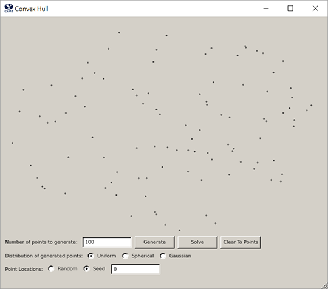

# Project 2: Convex Hull (Divide and Conquer)

### Framework
We provide a [framework](../project2-convex-hull/project2-convex-hull.zip) in Python to get you started and allow you to focus on the primary tasks of the project. In the framework you will find:
 
1. A Graphical User Interface that generates a specified number of random points. For each point, *x* and *y* are real numbers (doubles). The software has been built so that no two points should have the same *x* value, though there could be duplicate *y* values. This just makes life a little easier, as otherwise you would have to make sure your software properly deals with duplicate *x* value points. The GUI is provided in the file Proj2GUI.py.
2. A hook (the "Solve" button) which calls the method that you are going to implement. If you look in the file convex\_hull.py, you will find three parts of the compute\_hull() method that you need to implement. First, you will need to sort the list of points (QPointF objects) by ascending x-value. Next you will implement the divide and conquer algorithm described in class (you may create other methods and/or classes if you wish to do this). Last, you will pass a list of QLineF objects representing the segments on the convex hull to the GUI for display (see "dummy" example provided with the code).

### Instructions

1. Implement in Python the *n*log*n* divide and conquer algorithm presented in class and in the slides. Comment appropriate parts with their time efficiency. Implement your algorithm in the following method:
	1. ConvexHullSolver.compute\_hull( self, unsorted\_points )
	2. Use your divide and conquer algorithm to find the convex hull of the points in pointList.
	3. You may use the GUI method addLines() to draw the line segments of the convex hull on the UI once you have identified them.
	4. You do not need to implement your own sorting algorithm (though you may), but you do need to sort in worst case *n*log*n* time and discuss this complexity in your complexity discussion below.  If you used a sort worse than *n*log*n* then that would increase the big-O complexity of your entire algorithm.

4. Conduct an *empirical analysis* of your algorithm by running several experiments as follows:
	1. For each value *n* ∈ {10, 100, 1000, 10,000, 100,000, 500,000, 1,000,000}
		1. Generate 5 sets of *n* points (*x*,*y*) in the plane using uniform point generation. 
		2. For each point set,
			1. find the convex hull
			2. record the elapsed time (wall time or cpu time, just be consistent)
		3. For each size *n*, compute the mean time *t* required.

	2. Plot *n* (independent variable) versus *t* (dependent variable). It is best to use a logarithmic scale for *n*. Explain how that effects the expected shape of your distribution. For graphing you may use any resource you want, including a spreadsheet. One of the best tools for graphing is the matplotlib library which you can load for Python.
	3. As a sanity check, typical run times for 1,000,000 points are about 10-15 seconds (wall time) and will differ somewhat based on the speed of your computer. However, if your run-times are significantly slower (e.g more than a couple minutes), then you have probably not implemented the *n*log*n* algorithm correctly and you will lose points proportional to how much slower you are.

5. Find the relation of your plot (empirical analysis) to the theoretical *n*log*n* complexity for this algorithm. Does the empirical data match the *n*log*n* expected? If so, what is the constant of proportionality *c* for the *n*log*n* which makes it best match your empirical data? If not, then which function g(n) best fits your empirical data, and what is its constant of proportionality? You can fit a function analytically using software or by trial and error (in a spreadsheet, for example).

### Report

90 points total. The other 10 points come from your design experience.
Submit a type-written report with the following numbered sections as a single PDF document. Points are shown in brackets.

1. [40] Correct functioning code to solve the Convex Hull problem using the *n*log*n* divide and conquer algorithm presented in class, with appropriate comments.
2. [20] Discuss the time and space complexity of your algorithm. Also show and discuss the recurrence relation and Master Theorem complexity which should give the same complexity. You must demonstrate that you really understand the complexity and which parts of your program lead to that complexity. You may do this by:
	1. Showing and summing up the complexity of each significant subsection of your code, or
	2. Creating brief psuedocode showing the critical complexity portions, or
	3. Using another approach of your choice. For whichever approach you choose, include sufficient discussion/explanation to demonstrate your understanding of the complexity of the entire problem and any significant subparts. 
3. [10] Include your raw and mean experimental outcomes, plot, and your discussion of the pattern in your plot. Which order of growth fits best? Give an estimate of the constant of proportionality. Include all work and explain your assumptions.
4. [5] Discuss and explain your observations with your theoretical and empirical analyses, including any differences seen.
5. [15] Include a correct screenshot of an example with 100 points and a screenshot of an example with 1000 points.
