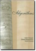

# CS 312 - Algorithms

*Course Syllabus*

## Quick links

- [Canvas](https://byu.instructure.com/courses/26124)
- [Schedule](schedule.md)
- [Homework Assignments](assignments.md)
- [Projects](projects/project-instructions.md)

## Instructors

| Instructor | Office | Office Hours |
| --- | --- | --- |
| **Spencer Low** | TMCB 256 | By appointment (DM on Discord please) |

## Teaching Assistants

Office: **1156 TMCB**

### Hours 

* TA's may be available on Saturday but requires an appointment.

| Time  | Monday         | Tuesday        | Wednesday      | Thursday       | Friday      |
|-------|----------------|----------------|----------------|----------------|-------------|
| 9:00  |                |                |                |                |             |
| 10:00 |                |                |                |                |             |
| 11:00 |  Matthew       |  Matthew       |  Matthew       |  Matthew       |  Matthew    |
| 12:00 |  Matthew       |  Matthew       |  Matthew       |  Matthew       |  Matthew    |
| 1:00  |  Jaycelyn      |  Jaycelyn      |  Jaycelyn      |  Jaycelyn      |  Jaycelyn   |
| 2:00  |  Jaycelyn      |  Jaycelyn      |  Jaycelyn      |  Jaycelyn      |  Jaycelyn   |
| 3:00  |                |                |                |                |             |
| 4:00  |                |                |                |                |             |
| 5:00  |                |                |                |                |             |
| 6:00  |                |                |                |                |             |
| 7:00  |                |                |                |                |             |
| 8:00  |                |                |                |                |             |

## Class Time and Place

- Section 001: 9:30-10:45 AM Mon/Tue/Wed/Thur **TMCB 120**

**[Discord Server](discord.md)**

## Course Description

We will study several general approaches to algorithm design, including *Divide and Conquer*, *Graph-based*, *Greedy*, *Dynamic Programming*, *Linear Programming*, *Intelligent Search*, as well as **briefly** treat some advanced topics. We will discuss canonical problems, abstraction and reduction as tools for problem solving, and we will also consider how to tell if an algorithm is correct and how to analyze it's complexity.

### Course Platform

We will use [Canvas](https://canvas.byu.edu) to administer the course. Your grade and course progress are visible in Canvas. 

You will turn in homework and projects via Gradescope, which will be linked from Canvas. Upload a PDF or image of your homework assignments. Upload a PDF of your project writeups. 

We will use [Discord](discord.md) for class communication.

### Text & Reading

The text for the class is [*Algorithms*](http://www.amazon.com/Algorithms-Sanjoy-Dasgupta/dp/0073523402) by Dasgupta, Papadimitriou, and Vazirani. We will cover much of the
 text following the provided [schedule](schedule.md). You are responsible
 for reading the material for a given day *prior* to that
 day's lecture. Because class time is limited, we may not
 cover everything in the text. However, except where
 specifically noted otherwise, you are responsible for the
 entire text.

### Attendance & Participation

Class attendance and participation are expected. 

### Homework Assignments

A few problems will be assigned (typically from the text) each class period and will be due at the beginning of class the following period. It is very important to stay current in this class and this [homework schedule](assignments.md) is designed to help you do so.

Homework assignments are turned in via Gradescope. **Access Gradescope via the links provided in Canvas.**

### Communicating clearly and concisely
 
What you have to say is an important skill you will use
 throughout your career. All written assignments are to be
 neat and professional. If you cannot clearly communicate something, there is a good chance that you do not yet understand it well. Good writing, grammar, punctuation, etc. are important and can affect your grade.

### Programming Projects

**[Installing Python](installing-python.md)**

There will be 5 individual programming projects throughout the semester and one final group project. For each project, you will solve a concrete problem by implementing an algorithm in such a way as to meet a conservative performance requirement. A reasonable implementation will sail through the performance requirement. You will prepare a typed report electronically according to the guidelines for each project. You will answer questions posed in the project guidelines and usually report the results of an empirical analysis of your algorithm. All project reports should include a copy of your documented source code and a screenshot demonstrating the working algorithm. 
Each project except the last (group) project will include an initial "design experience" to encourage you to think before you code. These experiences are worth 10% of your project grade and will be evaluated using an online quiz and are typically due about a 10 days before the finished project. More information on projects and design experiences can be found [here](projects/project-instructions.md).

Projects are submitted via Gradescope. **Access Gradescope via the links provided in Canvas**.

### Late Policy

All homework assignments are due at by **11:59pm** on the
 [date indicated](schedule.md). All programming assignments and design experiences 
 are due electronically by 11:59:00PM on the [date indicated](schedule.md).

**Late work is not accepted.**

Note that the schedule is carefully designed to give you plenty of time between when we discuss in class the concepts needed for a project and when it is due. Please start early and make use of that time to do a good job. If you do not get the entire project completed by the deadline, make sure you submit what you have.

Of course, if you have extenuating circumstances that warrant an exception to the no late work policy, please talk to your instructor as soon as possible.

### Exams

There will be one mid-term (administered in the [testing center](https://testing.byu.edu))
 and one final (administered in class). These tests will be timed, you will be allowed one single-sided page of notes (two single-sided or one double-sided for the final), and
 they will consist of written problems similar to those encountered on the homework. 
 If you put in the time to understand the learning labs and programming assignments, the tests should not be too difficult. 
 The final will be largely weighted toward material not covered on the midterm; however, it will be
 comprehensive in that it will assume you understand the material covered throughout the course.
 A brief study guide for the midterm exam can be found [here](misc/midterm_study_guide.pdf), and one
 for the final exam can be found [here](misc/final_study_guide.pdf).

### Grading

|  |  |
| --- | --- |
| 15% | Homework |
| 40% | Programming Assignments |
| 22.5% | Midterm Exam |
| 22.5% | Final Exam |

Because the first programming assignment is simpler than the others, it will be worth concomitantly fewer points. Although your final class grade will not be available
 until the end of the term, a cumulative point total will be
 available online and will be updated regularly.
 You should check this periodically to ensure that my
 records are in accordance with the work you have done.
 Please bring any discrepancies to your instructor's attention immediately,
 as these things are usually easily resolved early and are
 often much more difficult as time passes.

Appealing grades on assignments and on tests begins with
 you. Make an effort to understand why you received the
 score that you did and make sure that you have a good
 reason to appeal. If after making these efforts, you still
 feel like you have a concern, the next step is to calmly
 and intelligently discuss it with TA. If after taking both
 of these steps you still are not satisfied, please discuss it with your instructor.

### Working Together

You may work together with other members of the class; in fact, you are strongly encouraged to do so; 
 however, do **NOT** turn in other people's work. This is a fine
 line that may require some judgment on your part. Examples
 of acceptable collaboration: discussing homework problems
 and solutions with others in the class; posting questions
 and/or answers to questions on the class discussion server;
 comparing learning results and conclusions from programming
 assignments with other class members. 
 
Unacceptable
 collaboration would include: simply copying homework, code or
 test answers from a friend or allowing someone else to copy
 homework, code or test answers. 

Take the time to understand all the help you receive.
 
Academic dishonesty will be grounds for failure of the course.
It is everyone's responsibility to ensure that the grade you are assigned
reflects your actual diligence and personal development. 

### BYU Honor Code

> As faculty, administration, staff, and students voluntarily commit to conduct their lives in accordance with the principles of the gospel of Jesus Christ, they strive to maintain the highest standards in their personal conduct regarding honor, integrity, morality, and consideration of others...  
> [Each commits to]:
> - Maintain an Ecclesiastical Endorsement, including striving to deepen faith and maintain gospel standards
> - Be honest
> - Live a chaste and virtuous life, including abstaining from sexual relations outside marriage between a man and a woman. Living a chaste and virtuous life also includes abstaining from same-sex romantic behavior.
> - Abstain from alcoholic beverages, tobacco, tea, coffee, vaping, marijuana, and other substance abuse
> - Participate regularly in Church services
> - Respect others, including the avoidance of profane and vulgar language
> - Obey the law and follow campus policies, including the CES Dress and Grooming standards
> - Encourage others in their commitment to comply with the Honor Code and Dress and Grooming standards.

### BYU Statement on Belonging

We are united by our common primary identity as children of God (Acts 17:29; Psalm 82:6) and our commitment to the truths of the restored gospel of Jesus Christ (BYU Mission Statement). We strive to create a community of belonging composed of students, faculty, and staff whose hearts are knit together in love (Mosiah 18:21) where:
- All relationships reflect devout love of God and a loving, genuine concern for the welfare of our neighbor (BYU Mission Statement);
- We value and embrace the variety of individual characteristics, life experiences and circumstances, perspectives, talents, and gifts of each member of the community and the richness and strength they bring to our community (1 Corinthians 12:12–27);
- Our interactions create and support an environment of belonging (Ephesians 2:19); and
- The full realization of each student’s divine potential is our central focus (BYU Mission Statement).

### Preventing & Responding to Sexual Misconduct

In accordance with Title IX of the Education Amendments of 1972, Brigham Young University prohibits unlawful sex discrimination against any participant in its education programs or activities. The university also prohibits sexual harassment—including sexual violence—committed by or against students, university employees, and visitors to campus. As outlined in university policy, sexual harassment, dating violence, domestic violence, sexual assault, and stalking are considered forms of "Sexual Misconduct" prohibited by the university.

University policy requires all university employees in a teaching, managerial, or supervisory role to report all incidents of Sexual Misconduct that come to their attention in any way, including but not limited to face-to-face conversations, a written class assignment or paper, class discussion, email, text, or social media post. Incidents of Sexual Misconduct should be reported to the Title IX Coordinator at [t9coordinator@byu.edu](mailto:t9coordinator@byu.edu) or (801) 422-8692. Reports may also be submitted through EthicsPoint at <https://titleix.byu.edu/report> or 1-888-238-1062 (24-hours a day). 

BYU offers confidential resources for those affected by Sexual Misconduct, including the university’s Victim Advocate, as well as a number of non-confidential resources and services that may be helpful. Additional information about Title IX, the university’s Sexual Misconduct Policy, reporting requirements, and resources can be found at <http://titleix.byu.edu> or by contacting the university’s Title IX Coordinator.

### Students With Disabilities

BYU is committed to providing reasonable accommodation
 to qualified persons with disabilities. If you have any
 disability that may adversely affect your success in this
 course, please contact the University Accessibility Center
 at 422-2767. Services deemed appropriate will be
 coordinated with the student and instructor by that
 office.

