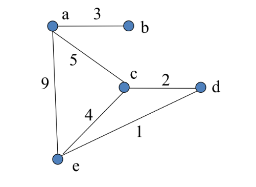

### Homework Assignment #15

Show all work neatly.

**Question 1 (5)**:  
You are given five matrices with the following dimensions:

- $M_{1}$ : 20 x 5
- $M_{2}$ : 5 x 10
- $M_{3}$ : 10 x 12
- $M_{4}$ : 12 x 6
- $M_{5}$ : 6 x 25
You wish to compute the product of the matrix chain $M_{1} M_{2} M_{3} M_{4} M_{5}$. What is the optimal (minimal) number of scalar multiplications required to compute this product? Use dynamic programming to compute the answer and show your work.

**Question 2 (5)**:  
For the following graph, step through Floyd’s algorithm (Floyd-Warshall), showing the **D** matrix at each step, and report the resulting shortest paths between all pairs ofvertices.

