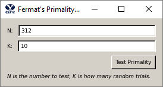

# Project 1: Primality Test

## Instructions

Download the [provided code](../project1-fermat/project1-fermat.zip/) for Project 1. 
Before you can run the provided GUI, you will need to setup and install Python 3 and PyQT6 (see the Python section in LS content).

You will implement the code that is executed when the "Test Primality" button is clicked (see image above which is part of the provided GUI). The provided file fermat.py includes 6 functions, 3 of which are called from the GUI. You will implement five of these functions (the 6th simply passes your results back to the GUI).
1. Code up the Fermat primality test pseudocode from Figure 1.8 of the text. You may set k to any value you like (see p. 27). This value indicates how many random trials (values of a) are used.
2. Implement modular exponentiation (pseudo-code in Figure 1.4 of the text). Your primality test should use your modular exponentiation function and should work properly for numbers as large as 2^30 = 1073741824.
3. Code the probability that $k$ Fermat trials gives  the correct answer -- see the discussion between Figure 1.7 and Figure 1.8.
4. Implement the Miller-Rabin primality test. There is no pseudo-code in the book for this, but you can find what you need in the sidebar on p. 28 and in the discussion below.
1. Code the probability that $k$ Miller-Rabin trials gives  the correct answer.

## Report
Number each part of your report to match the numbering below.  For number 1 you can just say "See Appendix." Do this for all your reports. This report should consist of: 
1.	All of the code that you wrote. If your code spans multiple files, make sure that you include all of it in your PDF appendix, and make sure that it is organized in a way that makes it easy for the reader (TA) to follow. Your code must include the following:
    - [15 points] A correct implementation of modular exponentiation.
    - [15 points] A correct implementation of the Fermat primality tester.
    - [10 points] A correct implementation of the Miller-Rabin algorithm.
2.	[15 points]. Discuss the time and space complexity of the Modexp and Fermat algorithms. You must demonstrate that you really understand the complexity and which parts of your program lead to that complexity.  You may do this by:
    - Showing and summing up the complexity of each significant subsection of your code, or
    - Creating brief psuedocode showing the critical complexity portions, or
    - Using another approach of your choice. 
For whichever approach you choose, include sufficient discussion/explanation to demonstrate your understanding of the complexity of the entire problem and any significant subparts.  Our Miller-Rabin algorithm will have a different time complexity than Fermat.  You can get up to 4 extra credit points if you correctly explain the Miller-Rabin complexity.
3.	[15 points] At least one screenshot of your application with a working example (distinct from the one above).
4.	[10 points] A brief discussion of some experimentation you did to identify inputs for which the two algorithms disagree. Give a good effort to explain why they disagree. Include a screenshot showing a case of disagreement.
5.	[10 points] Discuss the two equations you used to compute the probabilities $p$ of correctness for the two algorithms (Fermat and Miller-Rabin).

## Notes
- There is no performance requirement for this project. Correctness is the only criterion.
- This report is worth 90/100 points for the project, with the remaining 10 points accounted for in the design experience.
- Submit your PDF report following the submission directions in the Project Content section.

## The Miller-Rabin test

Let's say the number we are testing is $N=97$; just as in the Fermat case, we choose a random test in the range $1 ≤ a < N$. Suppose for our test we chose $a=3$; then, 

$$
a^{(N-1)} = 3^{96} = 6362685441135942358474828762538534230890216321 \equiv 1 \pmod {97}, 
$$

as Fermat's theorem says it should. Since this is $1 \pmod {97}$, if we take the square root, we would expect the result to be either 1 or -1. We can check this by computing 

$$
(3^{96})^{(\frac{1}{2})} = 3^{48} = 79766443076872509863361 \equiv 1 \pmod {97}
$$

just as expected. But, since this is also 1, we can take the square root again by computing 

$$
(3^{48})^{\frac{1}{2}} = 3^{24} = 282429536481 \equiv 96 \equiv -1 \pmod {97}
$$

which passed (still looks prime).

Once we get a $-1$, we can stop the sequence knowing the number is prime.  To demonstrate, if we continued taking square roots, we get 

$$
(3^{24})^{\frac{1}{2}} = 3^{12} = 531441 \equiv 75 \pmod {97}. 
$$

We can complete the sequence with 

$$
(3^{12})^{\frac{1}{2}} = 3^6 = 729 \equiv 50 \pmod {97}
$$
and
$$
(3^6)^{\frac{1}{2}} = 3^3 = 27 \equiv 27 \pmod {97}, 
$$

and we can't divide the exponent by 2 anymore, so the sequence ends.

To summarize, what we are doing here is repeatedly taking the square root of a number that is $\equiv 1 \pmod N$. 
For a while, the result is, 
not unexpectedly, $1 \pmod N$, but at some point it is $-1 \pmod N$. 
As we know, taking the square root of -1 is weird (though in this modular case that doesn't mean complex numbers; rather, we just get away from 1). 

What Miller and Rabin showed is that for prime numbers, for all choices of $a$, $1 \leq a < N$, this sequence of square roots, starting with a $1 \pmod N$, will either 
consist of all $1 \pmod N$, or, if at some point it changes to something else, that something else will always be $N-1 \equiv -1 \pmod N$, 
which is exactly what we saw in our example. 

What they also showed was that for composites (*including* Carmichael numbers), for 
at least **3/4** of the possible choices for $a$, this will not be the case—either the initial test will not equal 
$1 \pmod N$, just as in the Fermat case, or, if it does, in taking the series of square roots, the first number to show up 
after the sequence of 1s will be something other than $N-1 \equiv -1 \pmod N$.

Here is another example: suppose $N=561$ and we choose $a=4$. Then, computing our sequence of square roots, we get

$$
4^{560} = \text{a really big number}  \equiv 1 \pmod {561} 
$$

$$
4^{280} = \text{a smaller but still really big number}  \equiv 1 \pmod {561}
$$

$$
4^{140} = \text{a still pretty big number}  \equiv 1 \pmod {561}
$$

$$
4^{70} = 1393796574908163946345982392040522594123776 \equiv 67 \pmod {561} \leftarrow \text{Failed. Composite}. 
$$

Notice that this time, that when we encountered something other than $1 \pmod N$ in the sequence, it was also not $N-1 \equiv -1 \pmod N$.

This is common for composites, but **never** happens for primes. 

Hopefully now it is becoming clear how we can implement an
alternative to the Fermat-test-based primality testing
algorithm with this new information—if our number $N$ passes the initial test $a$
(which is equivalent to a Fermat test, right?), we then compute this sequence of square roots, looking for the first result that is not $1 \pmod N$. 
If there isn't one (because the entire sequence is 1s) or if the first such non-1 number is $N-1 \equiv -1 \pmod N$, 
$N$ has passed one round of the Miller-Rabin test $a$. We still don't know anything for sure (we can only demonstrate that a number is **not** prime vs is *probably* prime). 

So we continue to choose another random $a$ and repeat our test; however, if we instead find that there is a first result in the sequence that is neither $1 \: \text{nor} \: N-1 \equiv -1 \pmod N$, then we know the number is composite.

Note: In your report you discuss your efforts to find cases where Fermat and Miller-Rabin give different results.  Students often test the first Carmichael number (561) assuming the Fermat test will fail with that number, and Miller-Rabin will catch it.  The Fermat test will NOT always fail when testing a Carmichael number.  Carmichael numbers pass the Fermat test for all $a_{i}$ relatively prime to the number. Two integers are relatively prime if their greatest common denominator is 1. The probability that two random numbers are relatively prime is 60.8%. Thus, the Fermat test will still usually detect a Carmichael number as composite, but not in the case where the $a_{i}$ that are randomly chosen happen to be all relatively prime to the number, which becomes less likely as *k* increases.  As long as you make a good effort to try and find differences and discuss that effort, we will give you full credit for this part.

