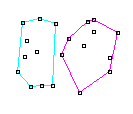
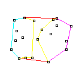
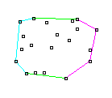
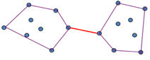
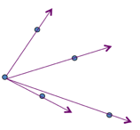

# Project 2: Convex Hull

### Background

The *convex hull* of a set *Q* of points is the smallest convex polygon *P* for which each point in *Q* is either on the boundary of *P* or in its interior. To be rigorous, a *polygon* is a piecewise-linear, closed curve in the plane. That is, it is a curve, ending on itself that is formed by a sequence of straight-line segments, called the sides of the polygon. A point joining two consecutive sides is called a *vertex* of the polygon. If the polygon is *simple*, as we shall generally assume, it does not cross itself. The set of points in the plane enclosed by a simple polygon forms the *interior* of the polygon, the set of points on the polygon itself forms its *boundary*, and the set of points surrounding the polygon forms its *exterior*. A simple polygon is *convex* if, given any two points on its boundary or in its interior, all points on the line segment drawn between them are contained in the polygon's boundary or interior.

 

### Divide and Conquer

In the divide-and-conquer method for finding the convex hull,
1. The set of *n* points is divided into two subsets, *L* containing the leftmost ⎡n/2⎤ points and *R* 
 containing the rightmost ⎣n/2⎦ points.
2. The convex hulls of the subsets *L* and *R* are computed recursively.

3. Then a clever method is used to combine the hulls:
	1. To merge the left hull CH(L) and the right hull CH(R), it is necessary to find the two edges known as the upper and lower common tangents (shown in red below). A common tangent of two simple convex polygons is a line segment in the exterior of both polygons intersecting each polygon at a single vertex. If continued infinitely in either direction, the common tangent would not intersect the interior of either polygon.
	2. The upper common tangent can be found by scanning around the left hull in a counter-clockwise direction and around the right hull in a clockwise direction. Some guidance with regard to finding the common tangents is given below; although you will need to work out some additional details. The two tangents divide each hull into two pieces. The right edges belonging to the left subset and the left edges belonging to the right subset must be deleted.

The remaining part of the algorithm is a solution for the base case (i.e., the leaves of your recursion). 
 In the example shown above, the final hull appears as follows:

Finding the upper common tangent:  

- Start with the rightmost point of the left hull and the leftmost point of the right hull
- While the edge is not upper tangent to both left and right

 
	- While the edge is not upper tangent to the left, move counter-clockwise to the next point on the left hull (Hint: We want to move to the next point(s) on the left hull as long as the slope decreases)
 	- While the edge is not upper tangent to the right, move clockwise to the next point on the right hull
 

Some Other Hints:  

Maintain clockwise (or counter-clockwise) ordering when merging (natural if you start that way). Note below that from one point (e.g. left-most) to each other point, clockwise order will be by decreasing slopes. 

Note that you can handle the two base cases (*n* = 2, and *n* = 3) by appropriately ordering those simple hulls. But, you can also have a single base case with *n* = 1, if you are careful with how you merge hulls, and this might be easier/more elegant.

You need to be careful when accessing your hull data structure since it is really a circular list. If using an array then make sure indexes properly change between the 0 element and the last element when you are moving either clockwise or counter-clockwise through the array.

Notes: The PyQt framework orients the x-axis in the usual way (from left to right), and the y-axis is also normal (increasing from bottom to top). Also, in python, floating point values are doubles by default, so no need to worry about precision there. but *the y-axis is oriented from top to bottom*. In other words, the origin for the space is in the upper left corner. This will influence how you think about the math, and the above will need to be adapted for this orientation. Also, floating-point precision can be an issue in this project. When computing the slope, the "run" can be very small. Use doubles instead of floats.

### Applications

More generally beyond two dimensions, the convex hull for a set of points *Q* in a real vector space *V* is the minimal convex set containing *Q*.

Algorithms for some other computational geometry problems start by computing a convex hull. Consider, for example, the two-dimensional farthest-pair problem: we are given a set of n points in the plane and wish to find the two points whose distance from each other is maximum. This pair is also referred to as the diameter of the set of points. You can prove that these two points must be vertices of the convex hull.

The problem of finding convex hulls also finds its practical applications in pattern recognition, image processing, statistics and GIS.

### Framework

We provide a [framework](../project2-convex-hull/project2-convex-hull.zip) in Python to get you started and allow you to focus on the primary tasks of the project. In the framework you will find:
 
1. A Graphical User Interface that generates a specified number of random points. The software has been built so that no two points should have the same *x* value, though there could be duplicate *y* values. This just makes life a little easier, as otherwise you would have to make sure your software properly deals with duplicate *x* value points. The GUI is provided in the file Proj2GUI.py.
2. A hook (the "Solve" button) which calls the method that you are going to implement. If you look in the file convex\_hull.py, you will find three parts of the compute\_hull() method that you need to implement. First, you will need to sort the list of points (QPointF objects) by ascending x-value. Next you will implement the divide and conquer algorithm described above (you may create other methods and/or classes if you wish to do this). Last, you will pass a list of QLineF objects representing the segments on the convex hull to the GUI for display (see "dummy" example provided with the code).

### Instructions

1. Write the full, unambiguous pseudo-code for your divide-and-conquer algorithm for finding the convex hull of a set of points *Q*. Be sure to label the parts of your algorithm. Also, label each part with its worst-case time efficiency.
2. Analyze the whole algorithm for its worst-case time efficiency. State the Big-O asymptotic bound. Discuss how this relates to the Master Theorem estimate for runtime.
3. Implement in Python the *n*log*n* divide and conquer algorithm we presented in class and in the slides. Comment appropriate parts with their time efficiency. Implement your algorithm in the following method:
	1. ConvexHullSolver.compute\_hull( self, unsorted\_points )
	2. Use the divide and conquer algorithm from step #1 to find the convex hull of the points in pointList.
	3. You may use the GUI method addLines() to draw the line segments of the convex hull on the UI once you have identified them.
	4. You do not need to implement your own sorting algorithm (though you may), but you do need to sort in worst case *n*log*n* time and discuss this complexity in your complexity discussion below.

4. Conduct an *empirical analysis* of your algorithm by running several experiments as follows:
	1. For each value *n* ∈ {10, 100, 1000, 10,000, 100,000, 500,000, 1,000,000}
		1. Generate 5 sets of *n* points (*x*,*y*) in the plane. You may use either provided point generator: the 2-D Gaussian (Normal) distribution or the uniform distribution. For every point, *x* and *y* are real numbers (doubles).
		2. For each point set,
			1. find the convex hull
			2. record the elapsed time
		3. For each size *n*, compute the mean time *t* required (elapsed time or cpu time, just be consistent).

	2. Plot *n* (independent variable) versus *t* (dependent variable). It is best to use a logarithmic scale for n. Explain how that effects the expected shape of your distribution. For graphing you may use any resource you want, including a spreadsheet. One of the best tools for graphing is the matplotlib library which you can load for Python.
	3. As a sanity check, typical run times for 1,000,000 points is about 10-15 seconds (wall time) and will differ somewhat based on the speed of your computer. However, if your run-times are significantly slower (e.g more than a couple minutes), then you have probably not implemented the *n*log*n* algorithm correctly and you will lose some points proportional to how much slower you are.

5. Find the relation of your plot (empirical analysis) to the theorietical *n*log*n* complexity for this algorithm. In other words, if your theoretical analysis says that for a set of *n* points *Q*, the convex hull CH(*Q*) ∈ O(*g*(*n*)), does *g*(*n*) actually fit your empirical data? If so, what is the constant of proportionality *k* so that CH(*Q*) = *k*·*g*(*n*)? If not, then which function *g*(*n*) best fits your empirical data, and what is the constant of proportionality? You can fit a function analytically using software or by trial and error in a spreadsheet, for example.

### Report

90 points total. The other 10 points come from your design experience.
Submit a type-written report with the following sections as a single PDF document. Points are shown in brackets.
 

1. [40] Correct functioning code to solve the Convex Hull problem using a divide and conquer scheme presented in class, with appropriate comments.
2. [20] Discuss the time and space complexity of your algorithm. You must demonstrate that you really
understand the complexity and which parts of your program lead to that complexity. You may do this by:
	1. Showing and summing up the complexity of each significant subsection of your code, or
	2. Creating brief psuedocode showing the critical complexity portions, or
	3. Using another approach of your choice.
For whichever approach you choose, include sufficient discussion/explanation to demonstrate your understanding of the complexity of the entire problem and any significant subparts. Also show and discuss the recurrence relation and Master Theorem complexity which should give the same bound.
3. [10] Include your raw and mean experimental outcomes, plot, and your discussion of the pattern in your plot. Which order of growth fits best? Give an estimate of the constant of proportionality. Include all work and explain your assumptions.
4. [10] Discuss and explain your observations with your theoretical and empirical analyses, including any differences seen.
5. [10] Include a correct screenshot of an example with 100 points and a screenshot of an example with 1000 points.

### Further Exploration

Here are (some non-exhaustive) suggestions 
 for possible algorithmic improvements. Implement another algorithm for computing the convex hull, CH(Q). Conduct a 
 similar theoretical and empirical analysis to determine how your new algorithm compares with the divide-and-conquer 
 algorithm.
Possibilities include:
 
1. the incremental method (see p. 948 of Cormen et al.)
2. the prune-and-search method (also see p. 948 of Cormen et al.)
3. Graham’s scan (p. 949 of Cormen et al.)
4. Jarvis’s march (using a technique known as “package wrapping” or “gift wrapping”) (see p. 955 of Cormen et al.).

You may find that beyond your algorithmic improvement, animating your algorithm will reveal interesting properties of 
 the nature and efficiency of your algorithm.

### Acknowledgements

Adapted from Cormen, Leiserson, Rivest, & Stein. 
 *Introduction to Algorithms*. Second Edition. MIT Press. 2001. pp. 939, 947-947. Additional input from the 
 Wikipedia article titled "Convex hull". Some figures from Tim Lambert of the University of New South Wales (UNSW).

 