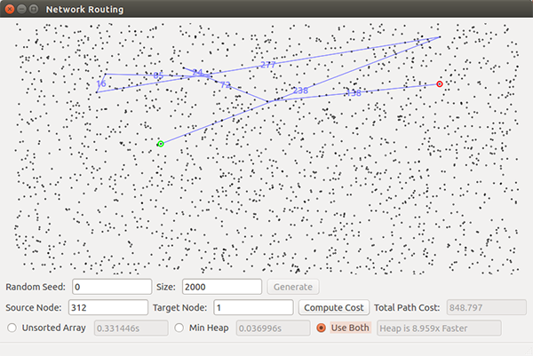
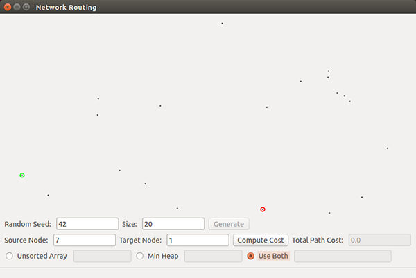
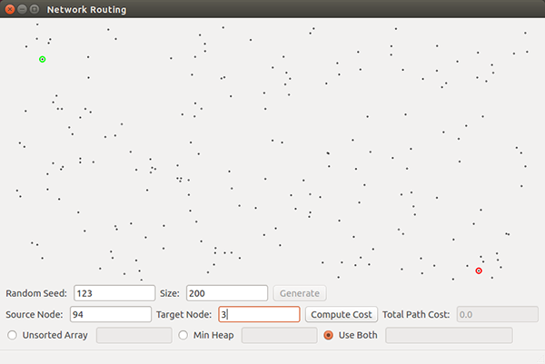
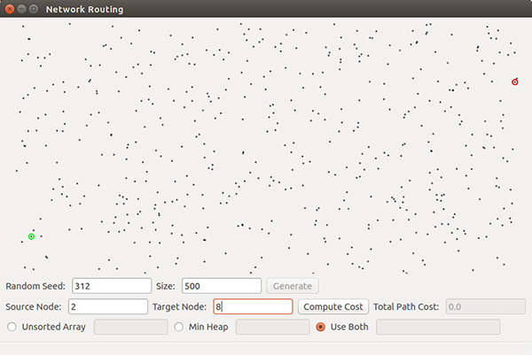
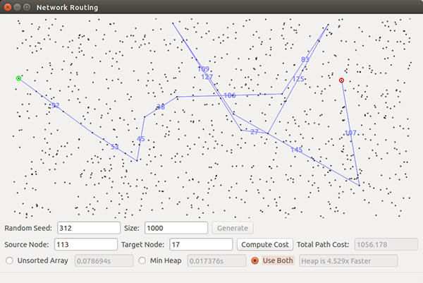
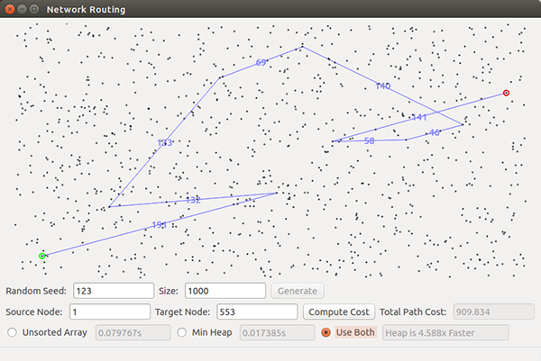

# Project 3: Network Routing

### Overview

In this project you will implement Dijkstra’s algorithm to find paths through a graph representing a network routing problem.

### Goals

1. Understand Dijkstra’s algorithm in the context of a real world problem.
2. Implement a priority queue with worst-case logarithmic operations.
3. Compare two different priority queue data structures for implementing Dijkstra’s and empirically verify their differences.
4. Understand the importance of proper data structures/implementations to gain the full efficiency potential of algorithms.

### Provided Framework

The Python framework is found [here](../project3-network-routing/project3-network-routing.zip). It provides: 

1. A graphical user interface that generates a graph/network with a specified number of points, for a provided random seed
2. A display for the graph vertices and for the subsequently computed shortest paths

When you hit “Generate” the framework for this project generates a random set of nodes, *V*, each with 3 randomly selected edges to other nodes. The edges are directed and the edge cost is the Euclidean distance between the nodes. Thus all nodes will have an out-degree of 3, but no predictable value for in-degree. You will be passed a graph structure which is comprised of |*V*| nodes, each with 3 edges, thus |*E*| = 3 |*V*| = O(|*V*|). The nodes have an (*x*,*y*) location and the edges include the start/end nodes and the edge length. The nodes are drawn on the display in the provided framework. You can hit “Generate” again to build a new graph (if you change the random seed). 

After generating, clicking on a node (or entering its index in the appropriate box) will highlight the source in green, and clicking another (or, again entering its index in the box) will highlight the destination in red. Each click alternates between the two. After these nodes are selected you can hit “Compute”, and your code should draw the shortest path starting from the source node and following all intermediate nodes until the destination node. Next to each edge between two nodes, display the cost of that segment of the route. Also, in the "Total Path Cost" box, display the total path cost. If the destination cannot be reached from the source then put “unreachable” in the total cost box. Clicking on the screen again will clear the current path while allowing you to set another source/destination pair.

The “Solve” button should (potentially) call two different versions of Dijkstra’s, one that uses an *array* to implement the priority queue, and one that uses a *heap*. (Use the standard Dijkstra's algorithm from the text which puts all nodes initially in the queue and finds the shortest path from the source node to all nodes in the network; after running that, then you just need to show the path from the source to the destination.) Both versions should give you the same path cost. While both versions have the same "high-level" big-O complexity for the graphs they generate, they will differ significantly in their runtime (why?). Each time you hit solve and show a path, display the time required for each version, and the times speedup of the heap implementation over the array implementation.

**To make sure everything is working correctly, first try some smaller problems that you can solve by hand.** Also, at the bottom of this page, we have included a screen shot for a particular 2000 vertex problem, which you can use as a debug check to help ensure your code is working correctly.

Note that here, since each node has a predefined maximum out-degree, O(|*E*|) = O(|*V*|). This will affect your empirical analysis. However, your algorithm handles all cases, including those where |*E*| is much larger than |*V*|. Thus, your complexity analysis (#3 below) should use the general case for |*E*| and |*V*|.

Note that in a stable network, a node could just run Dijkstra’s once for every node in the network and set up a routing table which it could then use for any message. However, for unstable networks (new nodes, outages, etc.) such a table would not necessarily be correct for very long.

### Instructions

1. Implement Dijkstra’s algorithm to find shortest paths in a graph.
2. Implement two versions of a priority queue class, one using an unsorted array (a python list) as the data structure and one using a binary heap.
	* For the array implementation, *insert* and *decrease-key* are simple O(1) operations, but *delete-min* will unavoidably be O(|*V*|).
	* For the heap implementation, all three operations (*insert*, *delete-min*, and *decrease-key*) should be worst case O(log|*V*|). For your binary heap implementation, you may implement the binary heap with an array, but also remember that *decrease-key* will be O(|*V*|) unless you have a separate array (or map) of object references into your binary heap, so that you can have fast access to an arbitrary node. Also, don't forget that you will need to adjust this lookup array/map of references every time you swap elements in the heap. (This was not discussed in detail in class, but you can figure it out.)

**You may NOT use an existing heap implementation**. You must implement both versions of the priority queue from scratch.

### Report

90 points total. The other 10 come from completing your design experience.
Submit a typed report in PDF format with the following information.

1. [15] Correctly implement Dijkstra’s algorithm and the functionality discussed above. Include a copy of your (well-documented) code in your submission.
2. [15] Correctly implement both versions of a priority queue, one using an array with worst case O(1), O(1) and O(|*V*|) operations and one using a heap with worst case O(log|*V*|) operations. For each operation (*insert*, *delete-min*, and *decrease-key*) convince us (refer to your included code) that the complexity is what is required here.
3. [20] Discuss the time and space complexity of the overall Dijkstra algorithm and each of your two versions with your priority queue implementations. You must demonstrate that you really understand the complexity and which parts of your program lead to that complexity. You may do this by:
	1. Showing and summing up the complexity of each significant subsection of your code, or
	2. Creating brief psuedocode showing the critical complexity portions, or
	3. Using another approach of your choice.
	For whichever approach you choose, include sufficient discussion/explanation to demonstrate your understanding of the complexity of the entire problem and any significant subparts.
4. [20] For Random seed 42 - Size 20, Random Seed 123 - Size 200 and Random Seed 312 - Size 500, submit a screenshot showing the shortest path (if one exists) for each of the three source-destination pairs, as shown in the images below.
	1. For Random seed 42 - Size 20, use node 7 (the left-most node) as the source and node 1 (on the bottom toward the right) as the destination, as in the first image below.
	2. For Random seed 123 - Size 200, use node 94 (near the upper left) as the source and node 3 (near the lower right) as the destination, as in the second image below.
	3. For Random seed 312 - Size 500, use node 2 (near the lower left) as the source and node 8 (near the upper right) as the destination, as in the third image below.
5. [20] For different numbers of nodes (100, 1000, 10000, 100000, 1000000), compare the empirical time complexity for Array vs. Heap, and give your best estimate of the difference. As a sanity check, typical runtimes for 100,000 nodes is a few mintues for the array and a few seconds for the heap. For 1,000,000 nodes, run only the heap version and then estimate how long you might expect your array version to run based on your other results. For each number of nodes do at least 5 tests with different random seeds and average the results. Graph your results and also give a table of your raw data (data for each of the runs); in both graph and table, include your one estimated runtime (array implementation for 1,000,000 points). Discuss the results and give your best explanations of why they turned out as they did.

---

A couple of other examples of expected output...

