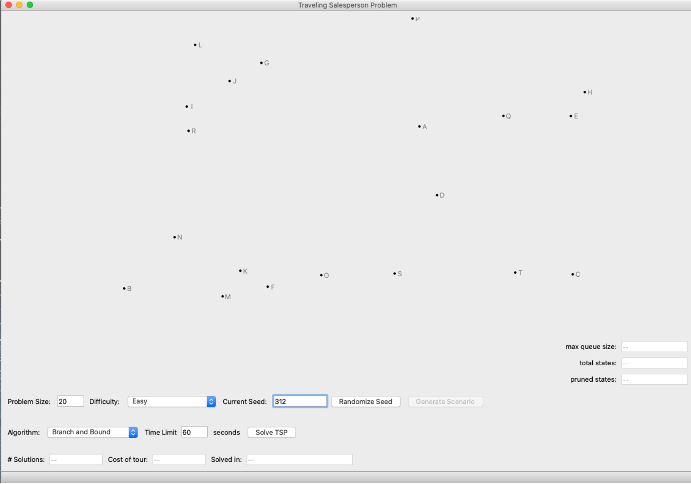
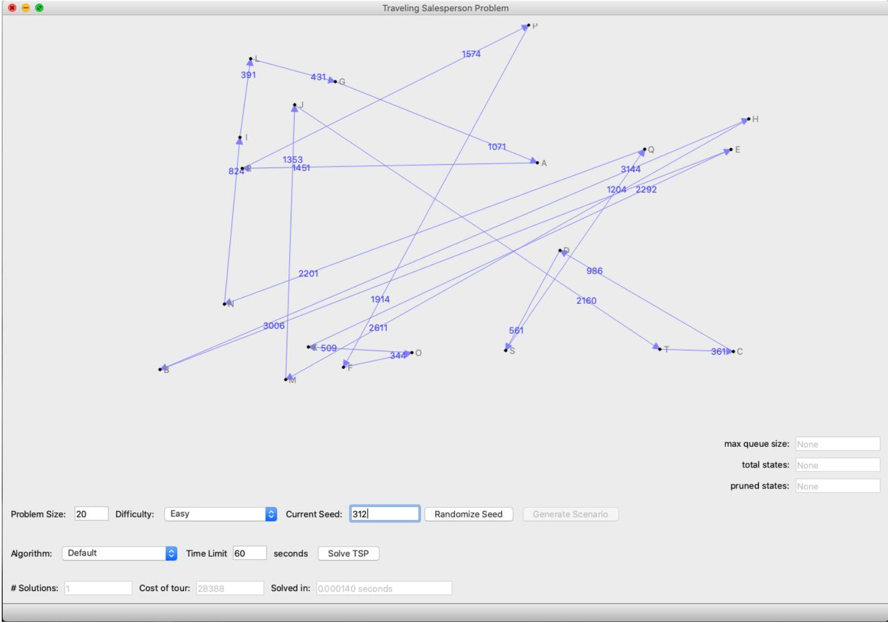
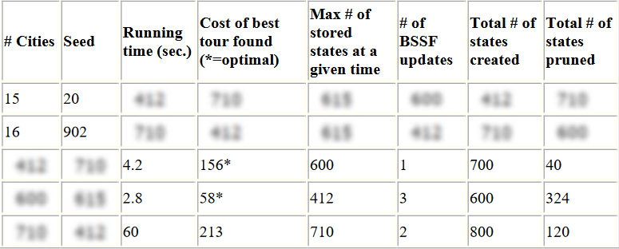

# Project 5: Travelling Salesperson (Intelligent Search)

### Provided Framework

We provide a  [framework](../project5-tsp/project5-tsp.zip/) that includes a user interface that generates a specified number of random points (the cities) on a 2-D canvas. The problems are generated based on a random seed, which you can set for debugging purposes. Clicking the "Generate Scenario" button resets the problem instance for the given "Current Seed". Clicking the "Randomize Seed" button chooses a new 3-digit random seed and updates the "Current Seed" field. You can control the problem size using the “Problem Size” field, as shown in the following figure:

The "Difficulty" drop-down menu allows you to select from one of three problem difficulty levels: Easy (totally connected symmetric), Normal (totally connected asymmetric), Hard (asymmetric and some infinite distances, not totally connected). You can play with all of them during testing but just use the Hard level for all of your reporting below. (Note: Easy employs a Euclidean distance function; Normal, a metric distance function; and Hard, a non-metric distance function. With a Euclidean distance function, the optimal tour cannot have crossed paths; however, in the case of a non-metric distance function, the optimal tour may have crossed paths.)

 The "Algorithm" pop-up menu allows you to select different algorithms for solving the problem. A simple random tour "Default" algorithm is already implemented. In the following figure, that default algorithm has been run on a random problem of size 20 of difficulty level Normal with a random seed of 312.

A word of clarification: the GUI currently has text by each city indicating the city "name". The *n* cities are A,B,...,Z,AA,BB, etc. On the solution returned by the solver, the order that the cities were visited is indicated by the arrows on each segment between cities and the corresponding length of each segment is indicated close to the arrowhead. The cost of the tour, the time spent finding the tour, and the number of solutions found are reported in the respective text boxes.

### Instructions

1. Implement a greedy algorithm which starts from an arbitrary city, picks the shortest path available to an unvisited city, then picks the shortest path from that city to an unvisited city, etc., until it returns to the origin city. Note that for Hard problems, it is possible to reach a city which has no paths to any remaining unvisited cities (don't forget to check for a path from the last city back to the first to complete the cycle). In such cases, there is no solution and you can just try again from a new start state.
2. Write a branch and bound algorithm (your TSP solver) to find the shortest complete tour through the *City* objects in the array *Cities*. You will use the reduced cost matrix for your lower bound function and “partial path” as your state space search approach. Implement your solver in the method `TSPSolver.branchAndBound()`.
2. Your `branchAndBound` solver should include a time-out mechanism so that it will terminate and report the best solution so far (*BSSF*) after 60 seconds of execution time.  You can use the "private" member *TSPSolver.\_time\_limit*, which is set to the default value 60 and automatically updates whenever the *Time Limit* field is edited in the application form. Note that it is not critical that you use precisely 60 seconds. Running a timer and checking the time on every iteration through your branch and bound algorithm is sufficient, if slightly imprecise. You can use timers to interrupt your search if you want to be more precise about ending exactly at 60 seconds.
3. Assign the "private" member *TSPSolver.\_bssf* to a *TSPSolution* object that contains the path you have discovered. You should be creative with your initial BSSF value as it can have a significant impact on early pruning.
4. To display your solution, populate the results array with the cost of the discovered tour, the elapsed time that it took to discover it, and the number of intermediate solutions considered, respectively. For an example of how to do this, you can look at the default algorithm *ProbemAndSolver.defaultRandomTour()* method. When counting intermediate solutions, do not include your initial BSSF Thus, the intermediate count will be 0 if the BSSF has not been updated before time expires.
5. For this project, the performance analysis will focus on both time and space. You will need a mechanism to report the total number of child states generated (whether they are put on the queue or not), and also the number of states pruned due to your evolving BSSF. You will also report the maximum size of the queue which is the upper bound of memory used.
7. Most of your results should include multiple BSSF updates (# of Solutions reported in GUI), especially for smaller numbers of cities. Because this can only happen when the search reaches a leaf node (finds a complete tour), and because expanding a state can add many child states to the queue, you must think carefully about your search strategy and come up with a priority key for the queue that implements it. While it is tempting (and probably useful) to visit states with a low bound, it is also important to find complete tours (so the BSSF can be updated and the tree can be pruned more), so your prioritization of states should consider both bound and tree depth (and anything else you can think of that improves performance---be creative).

### Report

90 points total. The other 10 points come from your design experience.

1. [30] Include your self-documenting code for both greedy and branch and bound.
2. [20] Discuss the time and space complexity of your algorithms. You must demonstrate that you really understand the complexity and which parts of your program lead to that complexity. You may do this by:
	1. Showing and summing up the complexity of each significant subsection of your code, or
	2. Creating brief psuedocode showing the critical complexity portions, or
	3. Using another approach of your choice.
For whichever approach you choose, include sufficient discussion/explanation to demonstrate your
understanding of the complexity of the entire problem and any significant subparts. Give specific
complexity discussion for each of the following things:
		* Greedy Algorithm
		* Priority Queue
		* Reduced Cost Matrix, including updating it
		* BSSF Initialization
		* Expanding one Search State into its children
		* The full Branch and Bound algorithm. You should be very exact on the complexities above. Time and Space complexity for the full branch and bound is harder to specify exactly but give your best effort to explain and discuss it.
3. [5] Describe the data structures you used to represent the states.
4. [5] Describe the priority queue data structure you use and how it works. You can use your previously implemented PQ code, or any version available, but you need to describe it.
5. [up to 5 extra credit points] Describe your approach for the initial BSSF. To get extra points you must do more than just use the BSSF value of a random path for the current city distribution. You could do something like use the greedy path or other approaches.
6. [20] Include a table containing the following columns.

*Note that the numbers in the above table are completely made up and may or may not 
have any correlation with reality.*

- Add two additional columns (not shown in the image) for each row showing the running time and tour cost for your Greedy algorithm. Your table must include at least 10 rows of results for 10 different problems ranging between 10 and 50 cities. The first two rows should report your results on the specific cities/seeds shown above (15/20 and 16/902). Of the 10 problems, 4 must run for the full 60 seconds (before timing out and returning the best solution found so far). # of BSSF updates is the number of times a solution was found which was better than the current BSSF. A value of 0 means the final solution was just the initial BSSF. Max stored states is the maximum size your queue ever becomes. Pruned states are a) those which are created but not put on the queue because their initial bound is greater than the current BSSF, and b) any states that are put on the priority queue, but are never actually expanded into children, because their lower bound became larger than the current BSSF. Do not include the many potential sub-states of those states which are implicitly pruned. If your timer runs out before completion, include in your pruned state count any states on the queue with bound greater than the final BSSF.
7. [5] Discuss the results in the table and why you think the numbers are what they are, including how states pruned and time and space complexity vary with problem size.
8. [5] Discuss the mechanisms you tried and how effective they were in getting the state space search to dig deeper and find more solutions early.

#### Debug Examples

To aid in debugging here are some results against which you can compare. We ran 5 trials for each in hard mode (a different set of missing edges each time) and reported the medians (ranges in brackets for times and total nodes).  

* problem size: 14; random seed: 1; cost of tour: 9844 ; time: ~7.23 secs [2.27-9.51s]; total nodes created: ~38K [13K-51K]
* problem size: 14; random seed: 2; cost of tour: 9549 ; time: ~1.43 secs [0.39s-67.53s]; total nodes created: ~8K [2K-286K]
* problem size: 14; random seed: 3; cost of tour: 9031 ; time: ~2.71 secs [1.11-4.93s]; total nodes created: ~14K [6K-27K]

Note that because each "hard" scenario is randomly generated with a different set of edges, the cost of the optimal tour is different and the results vary (as exemplified by a couple of trials on seed 2 with 57.69 and 67.53 seconds -- the other 3 were super fast).

To make things more predictable, we added a "Hard (Deterministic)" mode which uses the random seed to ensure that the edges are the same as well. With "Hard (Deterministic)" mode, we get the following results:
* problem size: 14; random seed: 1; cost of tour: 10573; time: ~8.45 secs *(median)*; total nodes created: ~46.5K
* problem size: 14; random seed: 2; cost of tour: 10061; time: 60 secs; total nodes created: ~290.2K
* problem size: 14; random seed: 3; cost of tour: 8638; time: 2.10 secs *(median)*; total nodes created: ~11.9K