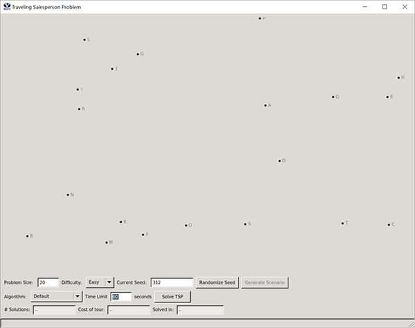
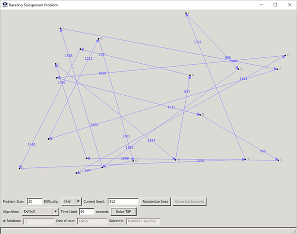

# Project 5: Travelling Salesman

### Overview

In this project, you will implement a branch and bound algorithm to find solutions to the traveling salesperson problem (TSP).

### Objectives

* Implement a branch and bound algorithm for finding solutions to the TSP
* Consider issues with trying to solve an NP-complete problem
* Further develop your ability to conduct empirical analysis

### Background

The TSP problem consists of the following:
* Given: a directed graph and a cost associated with each edge
* Return: the lowest cost complete simple tour of the graph

A complete simple tour is a path through the graph that visits every vertex in the graph exactly once and ends at the starting point, also known as a Hamiltonian cycle or Rudrata cycle. Note that as formulated here, the TSP problem is an optimization problem, in so far as we are searching for the simple tour with minimum cost.

We cover branch and bound, as well as B&B solutions to the TSP, in detail in the lectures in class and the accompanying reading. The appendix below reviews the reduced cost matrix bounding function which we discussed in class (also covered in the additional reading) and which you will use for this problem. The appendix also reviews the “partial path” approach to generating child (or “successor”) states in the state space, which you will also use for this project.

### Provided Framework

We provide a  [framework](../project5-tsp/project5-tsp.zip/) that includes a user interface that generates a specified number of random points (the cities) on a 2-D canvas. The problems are generated based on a random seed, which you can set for debugging purposes. Clicking the "Generate Scenario" button resets the problem instance for the given "Current Seed". Clicking the "Randomize Seed" button chooses a new 3-digit random seed and updates the "Current Seed" field.

You can control the problem size using the “Problem Size” field, as shown in the following figure:

The "Difficulty" drop-down menu allows you to select from one of three problem difficulty levels: Easy, Normal and Hard. The "Algorithm" pop-up menu allows you to select different algorithms for solving the problem. A simple random tour "Default" algorithm is already implemented. In the following figure, that default algorithm has been run on a random problem of size 20 of difficulty level Normal with a random seed of 312.

A word of clarification: the GUI currently has text by each city indicating the city "name". The *n* cities are A,B,...,Z,AA,BB, etc. On the solution returned by the solver, the order that the cities were visited is indicated by the arrows on each segment between cities and the corresponding length of each segment is indicated close to the arrowhead. The cost of the tour, the time spent finding the tour, and the number of solutions found are reported in the respective text boxes.

You will implement an additional algorithm (Branch and Bound) for this lab by writing code for the TSPSolver.branchAndBound() method. You will also use this framework for the group TSP project, in which you will implement two additional algorithms: a greedy approach and some other approach of your choosing.

### Instructions

1. Write a branch and bound algorithm (your TSP solver) to find the shortest complete simple tour through the *City* objects in the array *Cities*. You will use the reduced cost matrix for your lower bound function and “partial path” as your state space search approach. Implement your solver in the following method: `TSPSolver.branchAndBound()`.
2. Your `branchAndBound` solver should include a time-out mechanism so that it will terminate and report the best solution so far (*BSSF*) after 60 seconds of execution time (you can use the "private" member *TSPSolver.\_time\_limit*, which is set to the default value 60 and automatically updates whenever the *Time Limit* field is edited in the application form. Note that it is not critical that you use precisely 60 seconds. Running a timer and checking the time on every iteration through your branch and bound algorithm is sufficient, if slightly imprecise. You can use timers to interrupt your search if you want to be more precise about ending exactly at 60 seconds.
3. Assign the "private" member *TSPSolver.\_bssf* to a *TSPSolution* object that contains the path you have discovered. You should be creative with your initial BSSF value as it can have a significant impact on early pruning.
4. To display your solution, populate the results array with the cost of the discovered tour, the elapsed time that it took your to discover it and the number of intermediate solutions considered, respectively (for an example of how to do this, you can look at the default algorithm *ProbemAndSolver.defaultRandomTour()* method. When counting intermediate solutions, do not include your initial BSSF (this intermediate count will be 0 if the BSSF is optimal or time expires).
5. For this project, the performance analysis will focus on both time and space. You will need a mechanism to report the total number of child states generated (whether they are put on the queue or not), and also the number of states pruned due to your evolving BSSF. This includes all child states generated that never get expanded, either because they are not put on the queue, pruned when dequeued, or because they never get dequeued before termination. You will also report the maximum size of the queue which is the upper bound of memory used.
6. There are three difficulty levels that govern the city distributions: Easy (symmetric), Normal (asymmetric), Hard (asymmetric and some infinite distances). You can play with all of them during testing but just use the Hard level for all of your reporting below. Note Easy employs a Euclidean distance function; Normal, a metric distance function; and Hard, a non-metric distance function. With a Euclidean distance function, the optimal tour can not have crossed paths; however, in the case of a non-metric distance function, the optimal tour may have crossed paths.
7. Most of your results should include multiple BSSF updates (# of Solutions reported in GUI), especially for smaller numbers of cities. Because this can only happen when the search reaches a leaf node (finds a complete tour), and because each state can add many children states to the queue, you must think carefully about your search strategy and come up with a priority key for the queue that implements it. While it is tempting (and probably useful) to visit states with a low bound, it is also important to find complete tours (so the BSSF can be updated and the tree can be pruned more), so your prioritization of states should consider both bound and tree depth (and anything else you can think of that improves performance---be creative).
8. Implement a greedy algorithm which starts from an arbitrary city, picks the shortest path available to an unvisited city, then picks the shortest path from that city to an unvisited city, etc., until it returns to the origin city. Note that for Hard problems, it is possible to reach a city which has no paths to any remaining unvisited cities (don't forget to check for a path from the last city back to the first to complete the cycle). In such cases, there is no legal solution (unless you backtracked which you don’t here). Your algorithm should iteratively try starting from each city and return the best solution found for any of them.

### Report

100 points total. The other 10 points come from your design experience. (110 points in all.)

1. [40] Include your self-documenting code.
2. [20] Discuss the time and space complexity of your algorithm. You must demonstrate that you really understand the complexity and which parts of your program lead to that complexity. You may do this by:
	1. Showing and summing up the complexity of each significant subsection of your code, or
	2. Creating brief psuedocode showing the critical complexity portions, or
	3. Using another approach of your choice.
For whichever approach you choose, include sufficient discussion/explanation to demonstrate your
understanding of the complexity of the entire problem and any significant subparts. Give specific
complexity discussion for each of the following things:
		* Priority Queue
		* Reduced Cost Matrix, including updating it
		* BSSF Initialization
		* Expanding one Search State into its children
		* The full Branch and Bound algorithm. You should be very exact on the complexities above.
	4. Time and Space complexity for the full branch and bound is harder to specify exactly but give your best effort to explain and discuss it.
3. [5] Describe the data structures you used to represent the states.
4. [5] Describe the priority queue data structure you use and how it works. You can use your previously implemented PQ code, or any version available, but you need to describe it.
5. [up to 5 extra credit points] Describe your approach for the initial BSSF. To get extra points you must do more than just use the BSSF value of a random path for the current city distribution. You could do something like use the greedy path or other approaches.
6. [20] Include a table containing the following columns.

*Note that the numbers in the above table are completely made up and may or may not 
have any correlation with reality.*

- Your table must include at least 10 rows of results for 10 different problems ranging between 10 and 50 cities. The first two rows should report your results on the specific cities/seeds shown above (15/20 and 16/902). Of the 10 problems, 4 must run for the full 60 seconds (before timing out and returning the best solution found so far). # of BSSF updates is the number of times a solution was found which was better than the current BSSF. A value of 0 means the final solution was just the initial BSSF. Pruned states include a) those which are not put on the queue because their initial bound is greater than the current BSSF and also b) any states that are put on the priority queue, but when taken off the queue, their bound is now greater than the updated BSSF, thus allowing the state to be immediately pruned without expansion, or that are never taken off the queue at all. Just count the states actually pruned (not the many potential sub-states of those states which are also implicitly pruned).
7. [5] Discuss the results in the table and why you think the numbers are what they are, including how states pruned and time and space complexity vary with problem size.
8. [5] Discuss the mechanisms you tried and how effective they were in getting the state space search to dig deeper and find more solutions early.

#### Notes

To aid in your debugging here are some results we got against which you can compare. I ran 5 trials for each on in hard mode (a different set of missing edges each time) and have reported the medians (ranges in brackets for times and total nodes).  

* problem size: 14; random seed: 1; cost of tour: 9844 ; time: ~7.23 secs [2.27-9.51s]; total nodes created: ~38K [13K-51K]
* problem size: 14; random seed: 2; cost of tour: 9549 ; time: ~1.43 secs [0.39s-67.53s]; total nodes created: ~8K [2K-286K]
* problem size: 14; random seed: 3; cost of tour: 9031 ; time: ~2.71 secs [1.11-4.93s]; total nodes created: ~14K [6K-27K]

Note that because each "hard" scenario is randomly generated with a different set of edges, the cost of the optimal tour is different and the inherent difficulty varies (as exemplified by a couple of trials on seed 2 with 57.69 and 67.53 seconds -- the other 3 were super fast).

To make things a bit more predictable, I added a "Hard (Deterministic)" mode which uses the random seed to make sure that, just like the cities being generated in the same locations for a give size/seed pair, the edges removed will be consistent as well. So, under "Hard (Deterministic)" mode, I get the following results:
* problem size: 14; random seed: 1; cost of tour: 10573\* ; time: ~8.45 secs *(median)*; total nodes created: ~46.5K
* problem size: 14; random seed: 2; cost of tour: 10061; time: 60 secs; total nodes created: ~290.2K
* problem size: 14; random seed: 3; cost of tour: 8638\*; time: 2.10 secs *(median)*; total nodes created: ~11.9K

### Appendix

#### Bounding Function

Suppose we are given the following instance of the traveling salesperson problem for four cities in which the symbol "i" represents infinity.

	i  5  4  3  

	3  i  8  2  

	5  3  i  9  

	6  4  3  i  

One important element of a branch and bound solution to the problem is to define a bounding function. Our bounding function requires that we find a reduced cost matrix. The reduced cost matrix gives the additional cost of including an edge in the tour relative to a lower bound. The lower bound is computed by taking the sum of the cheapest way to leave each city plus any additional cost to enter each city. This bounding function is a lower bound because any tour must leave and enter each city exactly once, but choosing such edges may not define a solution.

First, let's reduce row 1. The smallest entry in row 1 is the cheapest way to leave city A. A row is reduced by taking the smallest entry in the row, 3 in this case, and subtracting it from every other entry in the row. The smallest entry (3) is also added to the lower bound. After reducing row 1, we have a bound of 3 and the following matrix:

	i  2  1  0  

	3  i  8  2  

	5  3  i  9  

	6  4  3  i  

Next, we reduce row 2 by taking the smallest entry in row 2, 2 in this case, and subtracting 2 from each entry in row 2. We add 2 to the bound and obtain the following matrix:

	i  2  1  0  

	1  i  6  0  

	5  3  i  9  

	6  4  3  i  

The remaining two rows are reduced in similar fashion. Lowest value 3 is subtracted from row 3, and 3 is likewise subtracted from row 4. The final bound is 3 + 2 + 3 + 3 = 11, and the reduced matrix so far is:

	i  2  1  0  

	1  i  6  0  

	2  0  i  6  

	3  1  0  i  

Reducing the rows only accounts for the cheapest way to leave every city. Reducing the columns includes the cheapest way to enter every city. Column reduction is similar to row reduction. A column is reduced by finding the smallest entry in a column of the reduced cost matrix, subtracting that entry from every other entry in the column and adding the entry to the bound.

The smallest entry in the first column is 1 so we subtract 1 from each entry in column 1 and add 1 to the bound. The new bound is 11 + 1 = 12 and the new matrix is:

	i  2  1  0  

	0  i  6  0  

	1  0  i  6  

	2  1  0  i  

The remaining columns are already reduced, since they already contain a 0.

#### Partial Path Approach to Generating Successor States

Another important element of a branch and bound solution is to define the manner in which children (or “successor”) states are expanded from a given state in the state space search. In the “partial path” approach, we generate multiple children for every parent: one for each city not yet included in the partial solution represented by the parent state.

Continuing the example from above, the matrix in its current form gives us a bound for the partial solution represented by a tour that starts at the city 1 (chosen 
arbitrarily) and contains no edges. This is the parent state (a matrix, a bound, and a partial tour). The child states will represent partial tours that include a single edge---one for each city not yet visited---in this case, cities 2, 3, 4.

Let's consider the child state for the partial tour 1->3. How do the matrix and boundchange compared to the parent state? Since we are adding the edge from city 1 to city 3, look at the entry (1,3) in the matrix, whose value is 1. This means that adding this edge will incur an additional cost of 1 (above the parent bound). Since the parent bound was 12, this means the child bound becomes 12 + 1 = 13. 

Now, because our partial tour comes from city 1 and goes to city 3, we must eliminate row 1 and column 3 from further consideration by descendant states. To do so, we simply seteach to infinity, and the updated matrix looks like:

	i  i  i  i  

	0  i  i  0  

	1  0  i  6  

	2  1  i  i  

Also, since we've now included the edge (1,3) in our solution, we must eliminate the edge (3,1) from consideration, so we set that entry in the matrix to infinity as well:

	i  i  i  i  

	0  i  i  0  

	i  0  i  6  

	2  1  i  i  

Notice that two of the rows that are not eliminated still have a 0 in them, but that the last one does not, so it must again be reduced, just as we did above, with the smallest value subtracted from each entry in the row and the bound increased accordingly. Here that smallest value is 1, so the bound now becomes 13 + 1 = 14, and the matrix gets reduced like this:

	i  i  i  i  

	0  i  i  0  

	i  0  i  6  

	1  0  i  i  

Since each column that's not been eliminated contains a 0, the matrix is again fully reduced, and we are done computing the child state (the new longer tour, the new bound and the new matrix). If the bound for this child is less than the current BSSF, then the child is inserted into the priority queue. The remaining children of the parent state are computed similarly and inserted into the queue if their bounds are less than the BSSF.

Following the branch-and-bound algorithm from the lectures, the next step is to dequeue the most promising node and repeat the process. This continues until a solution is found. You know you've found a solution when you've included enough edges to form a tour. When a solution is found, check to see if that solution improves the previous best solution (so far). If so, the new solution is the best solution so far. If the new solution is now the best solution so far, then the priority queue may be trimmed to avoid keeping unpromising states around. We iterate until the queue is empty or until time is exhausted.
